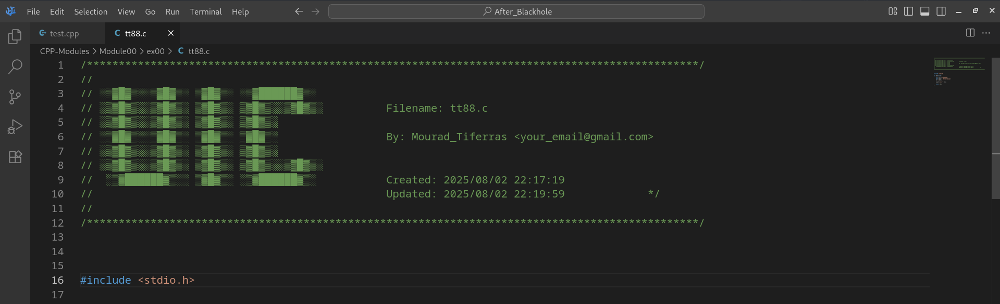

# UIC File Heading Tool

# 

A lightweight Bash script to insert or update a stylish ASCII banner (inspired by the 42 header) at the top of your source files.  
It adds author information, creation date, and updates the `Updated:` timestamp every time you save or manually re-run the tool.

---

## 🎯 Features

- 🧠 Inserts a custom ASCII banner at the top of your file.
- ⏱️ Automatically updates the `Updated:` timestamp if the header already exists.
- 💻 Supports C, Bash, Python, and other text-based source files.
- 💡 Works manually or can be automated in editors like **VSCode**.

---

## ⚙️ Setup

### 🔁 One-Time Installation

1- Update AUTHOR and EMAIL from `file_heading.sh`

2- Run this `setup.sh` inside this project directory. Then, you can cofigure your VSCode to automate the update

### Manual usage:

Example running: `hduic File_Name.cpp`
